# Inventory Tracker

A web application for tracking stock levels.

**Live application: [inventtracker.com](https://inventtracker.com)**

---

## What it does

Inventory Tracker keeps a list of products and how many of each are in stock. You can search for an item by name or product code, sort the list, filter it down to items running low, and adjust quantities up or down as stock moves. Items that are no longer carried can be retired without deleting their history, and retired items can be brought back.

It began as an Android application built in CS 360 that stored its data on a single phone. Only the person holding that phone could see or change anything, and if the phone was lost the inventory went with it. This version runs as a website, so several people can work from the same inventory at the same time, and the data lives in a managed database that is backed up automatically.

## What it is built from

| Layer | Technology |
| --- | --- |
| Client | Angular 22, standalone components and signals |
| Web server | nginx, serving the compiled client and routing API calls |
| API | PHP 8.4 with Restler 6 |
| Data access | Doctrine ORM 3 with versioned migrations |
| Database | MySQL 8.0 on AWS RDS |
| TLS | Caddy, with certificates issued and renewed automatically |
| Local development | Docker Compose, every image pinned to an exact version |

## How the pieces fit together



The client and the API are served from the same origin, which is why the browser never makes a cross-origin request and CORS stays switched off. The database is not reachable from the internet at all, and the API reaches it over an encrypted connection that the server refuses to make in plain text.

## Documentation

| Document | What is in it |
| --- | --- |
| [Architecture](https://ybetancourt9.github.io/inventory-tracker.web-app/docs/architecture) | Diagrams for the request lifecycle, the database schema, and the deployment |
| [API reference](https://ybetancourt9.github.io/inventory-tracker.web-app/docs/api) | Every endpoint, its parameters, responses, and error codes |
| [Decision records](https://ybetancourt9.github.io/inventory-tracker.web-app/docs/decisions) | Twenty decisions, what each cost, and why the alternative was rejected |

Diagram sources live in [`docs/diagrams`](docs/diagrams) as Mermaid text and are rendered to SVG by `scripts/render-diagrams.ps1`.

## Context

The application was enhanced across the three categories the capstone requires. Each has a written narrative explaining what changed and why.

**Software design and engineering.** The monolithic Android application was separated into an Angular client, a REST API, and a database, with authentication built around JSON Web Tokens and passwords hashed with Argon2id.

**Algorithms and data structures.** Search, sorting, filtering, and pagination were pushed into indexed database queries rather than done in application memory. Query plans were measured against twenty thousand rows rather than assumed, and more than one design changed as a result.

**Databases.** The data moved from a local SQLite file to MySQL on AWS RDS, with the schema defined by versioned migrations, a constraint that makes negative stock impossible, an atomic update that fixes lost updates under concurrent changes, and an application account restricted to reading and writing rows.

## Running it locally

Docker is the only requirement. Nothing is installed on the host.

```bash
cp .env.example .env      # then fill in the values
docker compose up -d
```

| Service | Address |
| --- | --- |
| Client, with live reload | http://localhost:4200 |
| API | http://localhost:8080 |

Quality checks run inside the API container.

```bash
docker compose exec api php vendor/bin/phpcs                       # PSR-12
docker compose exec api php vendor/bin/phpstan analyse             # level 6
docker compose exec api php vendor/bin/phpunit --testsuite unit
docker compose exec api php vendor/bin/phpunit --testsuite integration
```

The two test suites are separate on purpose. Unit tests run against in-memory doubles and verify logic. Integration tests run against a real MySQL instance and verify the queries themselves, which is a distinction that caught a bug the unit tests could not see.

## Repository layout

```
api/            PHP REST API
  src/Domain/         entities, value objects, repository interfaces
  src/Application/    use-case services
  src/Infrastructure/ Doctrine adapters
  src/Api/            HTTP endpoints
  migrations/         versioned schema changes
  tests/              unit and integration suites
web/            Angular client
docker/         nginx configuration
deploy/         AWS deployment configuration
docs/           architecture and API documentation
```
