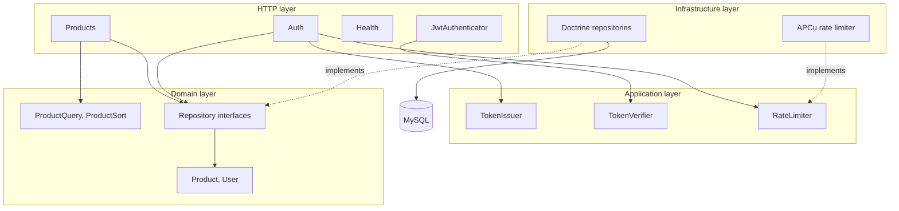
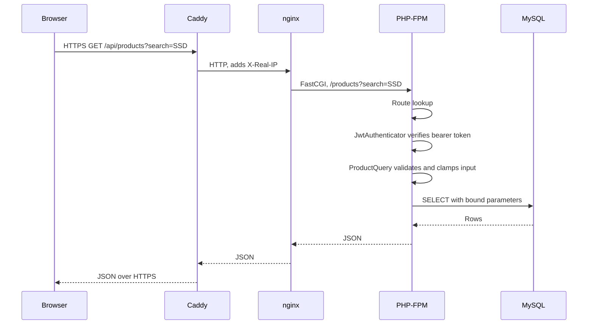
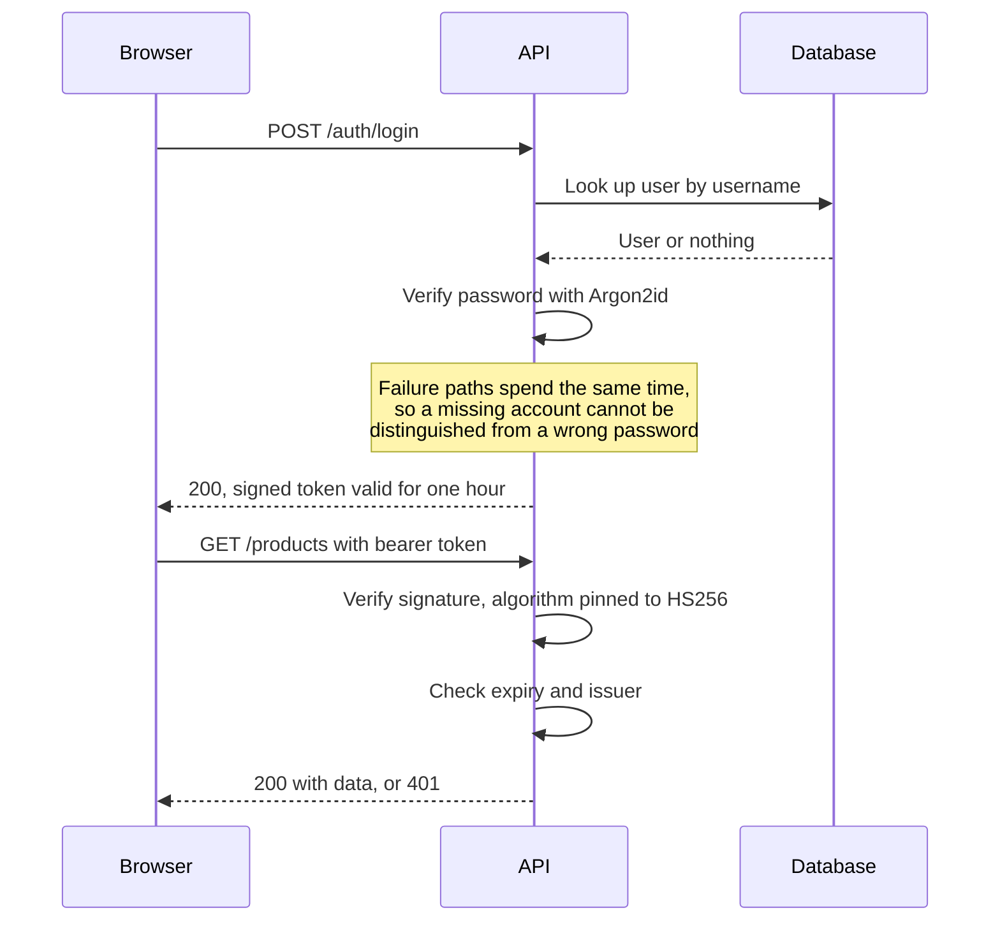
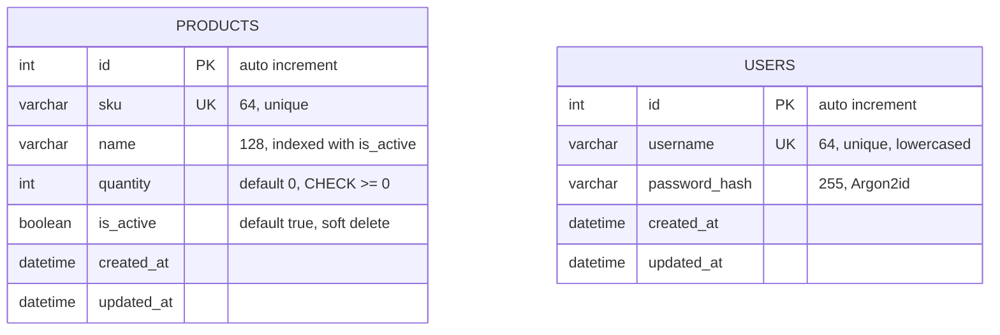
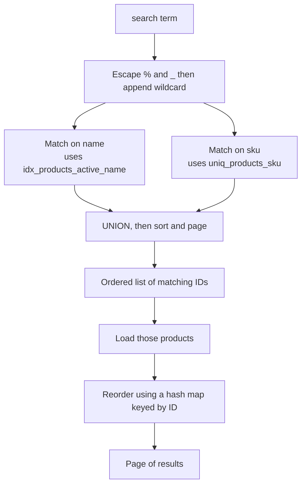
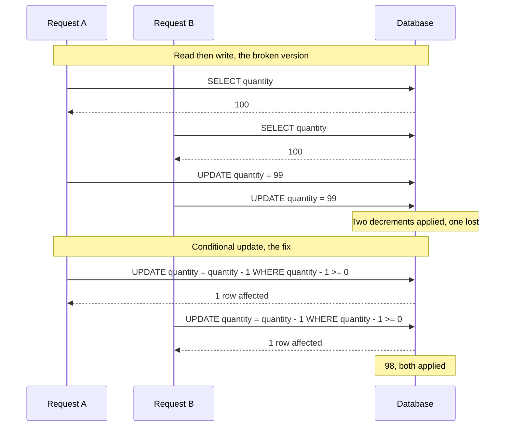
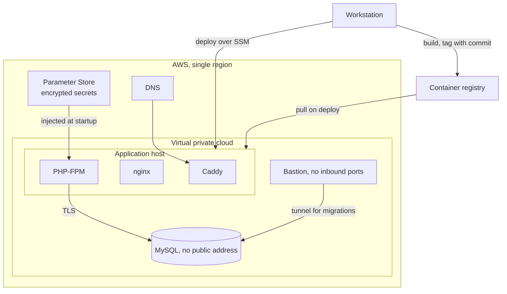

# Architecture

How the Inventory Tracker is put together, and why it is put together that way.

## Contents

- [Layers](#layers)
- [Request lifecycle](#request-lifecycle)
- [Authentication](#authentication)
- [Database schema](#database-schema)
- [How a search is executed](#how-a-search-is-executed)
- [Concurrent stock changes](#concurrent-stock-changes)
- [Deployment](#deployment)

## Layers

The API follows a ports and adapters arrangement. The domain layer holds entities and the interfaces they need, and it depends on nothing. Infrastructure supplies the implementations. The consequence is that business rules can be tested without a database, and the database can be swapped without touching them.

The dotted lines are the inversion. Nothing in the domain layer knows Doctrine exists. The composition root in `api/public/index.php` is the single place where interfaces are bound to implementations, which means the wiring is readable in one file rather than scattered across the codebase.

## Request lifecycle

Every request enters through a single front controller. nginx rewrites all non-file requests to `index.php` and refuses to execute any other PHP file, so there is exactly one way in.

Two details in that chain matter more than they look.

nginx strips the `/api` prefix before handing the request to PHP, so the API has no knowledge of being mounted under a path. Caddy sets `X-Real-IP` and nginx is configured to trust it only from the container network, which is what lets rate limiting see the real caller rather than treating every request as coming from Caddy.

## Authentication

Authentication is stateless. There is no server-side session, so any instance can serve any request.

The verification step pins the algorithm rather than reading it from the token. A token that declares a different algorithm is rejected instead of being verified on its own terms, which closes the algorithm confusion attack where a caller supplies a token asking to be checked with a weaker scheme.

Rate limits apply before any work is done. Login allows twenty attempts per address and ten per username in a fifteen minute window, and registration allows five per address per hour. Exceeding either returns 429 with a `Retry-After` header.

## Database schema

Two tables, with no relationship between them.

**There is deliberately no foreign key between them.** The application has no concept of product ownership. Every signed-in user works with the same shared inventory, which is how a stockroom actually operates. Adding an owner column would mean either assigning arbitrary owners to existing products or leaving the column empty everywhere, and both encode a relationship the domain does not have.

### Indexes

| Index | Columns | Serves |
| --- | --- | --- |
| `uniq_products_sku` | `sku` | Uniqueness, and lookup by product code |
| `idx_products_active_name` | `is_active`, `name` | Default listing, and the name half of search |
| `idx_products_active_quantity` | `is_active`, `quantity` | The low stock filter |
| `uniq_users_username` | `username` | Login lookup and uniqueness |

The composite indexes put the equality column first and the range column second. An index narrows left to right and stops narrowing once it meets a range condition, so `is_active` first lets the database seek straight to the active rows and then scan a contiguous slice. Reversing the order would force it to choose between filtering on one column and ranging on the other.

### Constraints

`CHECK (quantity >= 0)` is enforced by the database, not only by the application. A rule the application enforces holds as long as every code path remembers to call it. A rule the database enforces holds regardless of what sends the statement.

## How a search is executed

Searching name and SKU in a single condition reads naturally and performs badly, because the database cannot narrow its scan on one column when a row might qualify on the other. Measured against twenty thousand rows it examined 14,834 rows to return 25.

The query is therefore split so each half can use its own index, and the results are combined.

The wildcard is only appended, never prepended. A pattern like `term%` can use an index, while `%term%` forces a full scan and would undo the point of indexing the column. The cost of that decision is that searching for a word in the middle of a name will not match it, which is a real limitation and a deliberate trade.

The hash map exists because the second query returns rows in whatever order the database finds convenient, so the sort has to be reapplied. Searching the result list for each ID would be linear per lookup and quadratic overall. A map keyed by ID makes each lookup constant time and the whole reorder linear.

## Concurrent stock changes

The original implementation read the current quantity, adjusted it in application code, and wrote the result back. One hundred simultaneous decrements against a stock of one hundred lost forty one of them, silently.

The arithmetic and the floor check happen inside a single statement, so the database decides the outcome rather than the application. When the condition fails no row is affected, and the API turns that into a 409 rather than reporting a success that did not happen.

## Deployment

The application runs as container images on a single virtual machine, talking to a managed database.

Three decisions are worth calling out.

**Images are tagged with the commit they were built from.** A running host can always be traced back to an exact commit, and rolling back means deploying an earlier tag rather than reverting code.

**Secrets never touch disk.** Database credentials and the token signing key are read from Parameter Store at startup, written to a temporary filesystem that exists only in memory, consumed, and then destroyed. Nothing sensitive appears in the repository, in an image layer, or in a disk snapshot.

**There is no SSH.** Deployments and administration go through AWS Systems Manager, so the application host has no inbound port open other than the two the website needs, and no key pair exists to be stolen.

Database migrations are run manually through the bastion rather than as part of a deployment, because the account the application uses has no permission to change the schema. That is inconvenient by design.
